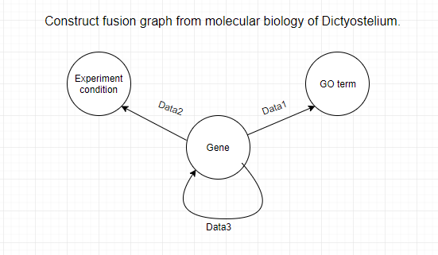
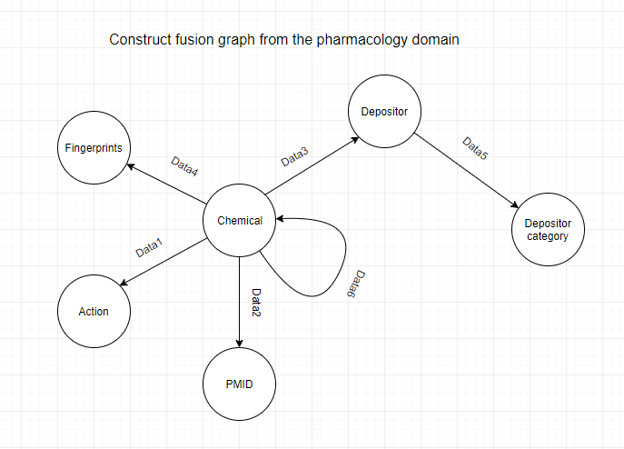

# Data-fusion-of-biological-data-using-multimodal-neural-networks-andmatrix-factorization

## Datasets
  Dictyostelium:
  - Gene - GO term [1219, 161]
  - Gene - Exeriment conditions [1219, 282]
  - Gene - Gene [1219, 1219]
  
  
  
  The pharmacology domain:
  - Chemical - Action [1260, 130]
  - Chemical - PMID [1260, 7948]
  - Chemical - Depositor [1260, 189]
  - Chemical - Fingerprints [1260, 920]
  - Depositor - Depositor category [189,16]
  - Chemical - Chemical [1260, 1260]
  
  
  
 ## Prediction DFMF
  - Dictyostelium Association: 0.0391 (MSE)
  - Dictyostelium Chaining: 0.54 (AUC) - max: 0.8036 (AUC)
  - Dictyostelium Factorization: (MF - matrix factorization) - (RF - random forest)
  