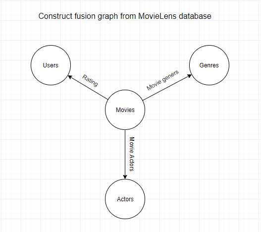

# Data-fusion-of-biological-data-using-multimodal-neural-networks-andmatrix-factorization

## Datasets
  ### Dictyostelium:
  - Gene - GO term [1219, 161]
  - Gene - Exeriment conditions [1219, 282]
  - Gene - Gene [1219, 1219]
  
  
  
  ### The pharmacology domain:
  - Chemical - Action [1260, 130]
  - Chemical - PMID [1260, 7948]
  - Chemical - Depositor [1260, 189]
  - Chemical - Fingerprints [1260, 920]
  - Depositor - Depositor category [189,16]
  - Chemical - Chemical [1260, 1260]
  
  
  
  ### MovieLens database:
  - User - Movie (rating): [706, 1000]
  - Movie - Genre (movie genres): [1000, 20]
  - Movie - Actor (movie actors): [1000, 1000]
  
  
  
 ## Prediction DFMF
  - Dictyostelium Association: 0.0391 (MSE)
  - Dictyostelium Chaining: 0.54 (AUC) - max: 0.8036 (AUC)
  - Dictyostelium Factorization: 0.922 (MF - matrix factorization) - 0.884 (RF - random forest)
  - Movielens Competition (RMSE): 
    - mean rating: 0.23856
    - mean user: 0.21979
    - mean movie: 0.21657
    - ratings DFMF: 0.20421
    - ratings DFMC: 0.21656
    - PCA: 0.35984
    - NMF: 0.61969